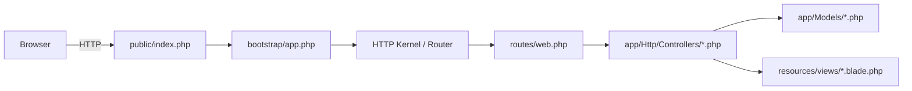

# ParkEasy — Project Architecture

## Overview
ParkEasy is a Laravel application. This document maps the main components, request flow, and key files so developers can quickly onboard and find where to implement features.

## High-level components
- Public webroot: [public/index.php](public/index.php#L1) — first PHP entrypoint.
- Bootstrap: [bootstrap/app.php](bootstrap/app.php#L1) — creates the application container.
- Routing: [routes/web.php](routes/web.php#L1) and [routes/console.php](routes/console.php#L1).
- HTTP controllers: app/Http/Controllers — request handling and business orchestration.
- Models: app/Models (example: [app/Models/User.php](app/Models/User.php#L1)) — Eloquent models and relationships.
- Views & frontend: resources/views, [resources/js/app.js](resources/js/app.js#L1), [resources/css/app.css](resources/css/app.css#L1) — built via Vite (`vite.config.js`).
- Database: database/migrations, database/factories, database/seeders.
- Config & services: config/*.php and app/Providers for bindings and bootstrapping.
- Tests: tests/ with Pest/PHPUnit bootstrapping ([tests/Pest.php](tests/Pest.php#L1)).

## Request flow
Browser → public/index.php → bootstrap/app.php → HTTP Kernel → Router ([routes/web.php](routes/web.php#L1)) → Controller (app/Http/Controllers) → Model (app/Models) → View (resources/views) or JSON response.

## Mermaid diagram


## Key files (quick links)
- Bootstrap: [bootstrap/app.php](bootstrap/app.php#L1)
- Routes: [routes/web.php](routes/web.php#L1)
- Example Model: [app/Models/User.php](app/Models/User.php#L1)
- Migrations: [database/migrations/0001_01_01_000000_create_users_table.php](database/migrations/0001_01_01_000000_create_users_table.php#L1)
- Frontend entry: [resources/js/app.js](resources/js/app.js#L1)
- Build config: [vite.config.js](vite.config.js#L1)
- Composer: [composer.json](composer.json#L1)
- NPM: [package.json](package.json#L1)

## Developer quick tasks
- Run dev server (assets):
```bash
composer install
npm install
npm run dev
```
- Run tests:
```bash
php artisan test --compact
```

---
If you want, I can add a more detailed domain model diagram, map service providers, or embed authorization and queue flows. Which would you like next?
